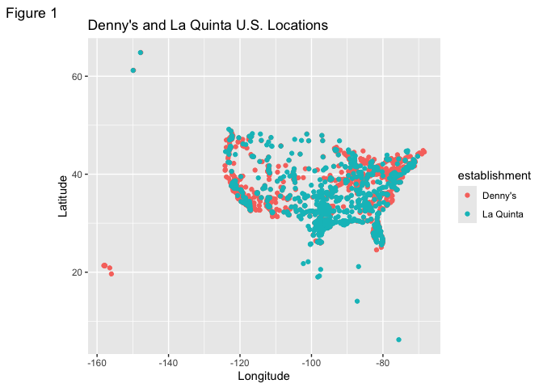

Lab 04 - Visualizing spatial data
================
Lilly McClendon
02-06-2025

### Load packages and data

``` r
library(tidyverse) 
library(dsbox) 
```

``` r
states <- read_csv("data/states.csv")
```

### Exercise 1

``` r
nrow(dennys)
```

    ## [1] 1643

``` r
ncol(dennys)
```

    ## [1] 6

``` r
str(dennys)
```

    ## spc_tbl_ [1,643 × 6] (S3: spec_tbl_df/tbl_df/tbl/data.frame)
    ##  $ address  : chr [1:1643] "2900 Denali" "3850 Debarr Road" "1929 Airport Way" "230 Connector Dr" ...
    ##  $ city     : chr [1:1643] "Anchorage" "Anchorage" "Fairbanks" "Auburn" ...
    ##  $ state    : chr [1:1643] "AK" "AK" "AK" "AL" ...
    ##  $ zip      : chr [1:1643] "99503" "99508" "99701" "36849" ...
    ##  $ longitude: num [1:1643] -149.9 -149.8 -147.8 -85.5 -86.8 ...
    ##  $ latitude : num [1:1643] 61.2 61.2 64.8 32.6 33.6 ...
    ##  - attr(*, "spec")=
    ##   .. cols(
    ##   ..   address = col_character(),
    ##   ..   city = col_character(),
    ##   ..   state = col_character(),
    ##   ..   zip = col_character(),
    ##   ..   longitude = col_double(),
    ##   ..   latitude = col_double()
    ##   .. )

#### Denny’s dataset dimensions

The Denny’s dataset dimensions are 1643 x 6, contains 1643 rows with
each row representing a Denny’s location and 6 columns (address, city,
state, zip, longitude, and latitude). The variables are address, city,
state, zip, longitude, and latitude.

### Exercise 2

``` r
nrow(laquinta)
```

    ## [1] 909

``` r
ncol(laquinta)
```

    ## [1] 6

``` r
str(laquinta)
```

    ## spc_tbl_ [909 × 6] (S3: spec_tbl_df/tbl_df/tbl/data.frame)
    ##  $ address  : chr [1:909] "793 W. Bel Air Avenue" "3018 CatClaw Dr" "3501 West Lake Rd" "184 North Point Way" ...
    ##  $ city     : chr [1:909] "\nAberdeen" "\nAbilene" "\nAbilene" "\nAcworth" ...
    ##  $ state    : chr [1:909] "MD" "TX" "TX" "GA" ...
    ##  $ zip      : chr [1:909] "21001" "79606" "79601" "30102" ...
    ##  $ longitude: num [1:909] -76.2 -99.8 -99.7 -84.7 -96.6 ...
    ##  $ latitude : num [1:909] 39.5 32.4 32.5 34.1 34.8 ...
    ##  - attr(*, "spec")=
    ##   .. cols(
    ##   ..   address = col_character(),
    ##   ..   city = col_character(),
    ##   ..   state = col_character(),
    ##   ..   zip = col_character(),
    ##   ..   longitude = col_double(),
    ##   ..   latitude = col_double()
    ##   .. )

#### La Quinta dataset dimensions

The La Quinta dataset dimensions are 909 x 6, contains 909 rows with
each row representing a La Quinta hotel and 6 columns (address, city,
state, zip, longitude, and latitude). The variables are address, city,
state, zip, longitude, and latitude.

### Exercise 3

There are La Quinta locations outside of the U.S. in Canada, Mexico,
China, New Zealand, Turkey, United Arab Emirates, Chile, Columbia, and
Ecuador. On the other hand, there are no Denny’s located outside of the
U.S.

### Exercise 4

I could determine whether or not either establishment has any locations
outside of the U.S. solely using the data by filtering for states that
appear in the states data set with abbreviations.I could also determine
which longitude and latitudes form the bounds of the U.S., and filter
for data that is located within those parameters.

### Exercise 5

``` r
dennys %>%
  filter(!(state %in% states$abbreviation))
```

    ## # A tibble: 0 × 6
    ## # ℹ 6 variables: address <chr>, city <chr>, state <chr>, zip <chr>,
    ## #   longitude <dbl>, latitude <dbl>

There are not any Denny’s locations outside of the U.S.

### Exercise 6

``` r
dennys_country <- dennys %>%
  mutate(country = "United States")
```

### Exercise 7

La Quinta has locations Canada, Chile, China, Columbia, Ecuador, Mexico,
New Zealand, Turkey, and United Arab Emirates.

### Exercise 8

``` r
library(dplyr)
laquinta %>%
summarize(state)
```

    ## Warning: Returning more (or less) than 1 row per `summarise()` group was deprecated in
    ## dplyr 1.1.0.
    ## ℹ Please use `reframe()` instead.
    ## ℹ When switching from `summarise()` to `reframe()`, remember that `reframe()`
    ##   always returns an ungrouped data frame and adjust accordingly.
    ## Call `lifecycle::last_lifecycle_warnings()` to see where this warning was
    ## generated.

    ## # A tibble: 909 × 1
    ##    state
    ##    <chr>
    ##  1 MD   
    ##  2 TX   
    ##  3 TX   
    ##  4 GA   
    ##  5 OK   
    ##  6 TX   
    ##  7 AG   
    ##  8 TX   
    ##  9 NM   
    ## 10 NM   
    ## # ℹ 899 more rows

``` r
state_counts <- table(laquinta$state)
print(state_counts)
```

    ## 
    ##  AG  AK  AL ANT  AR  AZ  BC  CA  CH  CO  CT  FL  FM  GA  IA  ID  IL  IN  KS  KY 
    ##   1   2  16   1  13  18   1  56   1  27   6  74   1  41   4  10  17  17   9  10 
    ##  LA  MA  MD  ME  MI  MN  MO  MS  MT  NC  ND  NE  NH  NJ  NL  NM  NV  NY  OH  OK 
    ##  28   6  13   1   4   7  12  12   9  12   5   5   2   5   3  19   8  19  17  29 
    ##  ON  OR  PA  PU  QR  RI  SC  SD  SL  TN  TX  UT  VA  VE  VT  WA  WI  WV  WY 
    ##   1  10  10   2   1   2   8   2   1  30 237  12  14   1   2  16  13   3   3

``` r
library(dplyr)
laquinta_international <- laquinta %>% 
  filter(!state %in% state.abb)
print(laquinta_international)
```

    ## # A tibble: 14 × 6
    ##    address                                  city  state zip   longitude latitude
    ##    <chr>                                    <chr> <chr> <chr>     <dbl>    <dbl>
    ##  1 Carretera Panamericana Sur KM 12         "\nA… AG    20345    -102.     21.8 
    ##  2 Av. Tulum Mza. 14 S.M. 4 Lote 2          "\nC… QR    77500     -86.8    21.2 
    ##  3 Ejercito Nacional 8211                   "Col… CH    32528    -106.     31.7 
    ##  4 Blvd. Aeropuerto 4001                    "Par… NL    66600    -100.     25.8 
    ##  5 Carrera 38 # 26-13 Avenida las Palmas c… "\nM… ANT   0500…     -75.6     6.22
    ##  6 AV. PINO SUAREZ No. 1001                 "Col… NL    64000    -100.     25.7 
    ##  7 Av. Fidel Velazquez #3000 Col. Central   "\nM… NL    64190    -100.     25.7 
    ##  8 63 King Street East                      "\nO… ON    L1H1…     -78.9    43.9 
    ##  9 Calle Las Torres-1 Colonia Reforma       "\nP… VE    93210     -97.4    20.6 
    ## 10 Blvd. Audi N. 3 Ciudad Modelo            "\nS… PU    75010     -97.8    19.2 
    ## 11 Ave. Zeta del Cochero No 407             "Col… PU    72810     -98.2    19.0 
    ## 12 Av. Benito Juarez 1230 B (Carretera 57)… "\nS… SL    78399    -101.     22.1 
    ## 13 Blvd. Fuerza Armadas                     "con… FM    11101     -87.2    14.1 
    ## 14 8640 Alexandra Rd                        "\nR… BC    V6X1…    -123.     49.2

#### La Quinta Locations Update

There are locations (Cancun, Apodaca, Monterrey, Tegucigalpa) in the
dataset that are not posted on the La Quinta website of locations. I
looked up the addresses to determine which country they were located in.

``` r
laquinta_country <- laquinta %>%
  mutate(country = case_when(
    state %in% state.abb ~ "United States",
    state %in% c("ON", "BC") ~ "Canada",
    state == "ANT" ~ "Colombia",
    state %in% c("AG", "QR", "CH", "NL","VE", "PU", "SL") ~"Mexico", 
    state == "FM" ~ "Honduras"
  )) %>% 
filter(country == "United States")
print(laquinta_country)
```

    ## # A tibble: 895 × 7
    ##    address                         city   state zip   longitude latitude country
    ##    <chr>                           <chr>  <chr> <chr>     <dbl>    <dbl> <chr>  
    ##  1 793 W. Bel Air Avenue           "\nAb… MD    21001     -76.2     39.5 United…
    ##  2 3018 CatClaw Dr                 "\nAb… TX    79606     -99.8     32.4 United…
    ##  3 3501 West Lake Rd               "\nAb… TX    79601     -99.7     32.5 United…
    ##  4 184 North Point Way             "\nAc… GA    30102     -84.7     34.1 United…
    ##  5 2828 East Arlington Street      "\nAd… OK    74820     -96.6     34.8 United…
    ##  6 14925 Landmark Blvd             "\nAd… TX    75254     -96.8     33.0 United…
    ##  7 909 East Frontage Rd            "\nAl… TX    78516     -98.1     26.2 United…
    ##  8 2116 Yale Blvd Southeast        "\nAl… NM    87106    -107.      35.1 United…
    ##  9 7439 Pan American Fwy Northeast "\nAl… NM    87109    -107.      35.2 United…
    ## 10 2011 Menaul Blvd Northeast      "\nAl… NM    87107    -107.      35.1 United…
    ## # ℹ 885 more rows

### Exercise 9

``` r
dennys %>% 
  count(state) %>% 
  arrange(desc(n))
```

    ## # A tibble: 51 × 2
    ##    state     n
    ##    <chr> <int>
    ##  1 CA      403
    ##  2 TX      200
    ##  3 FL      140
    ##  4 AZ       83
    ##  5 IL       56
    ##  6 NY       56
    ##  7 WA       49
    ##  8 OH       44
    ##  9 MO       42
    ## 10 PA       40
    ## # ℹ 41 more rows

``` r
laquinta_country %>% 
  count(state) %>% 
  arrange(desc(n))
```

    ## # A tibble: 48 × 2
    ##    state     n
    ##    <chr> <int>
    ##  1 TX      237
    ##  2 FL       74
    ##  3 CA       56
    ##  4 GA       41
    ##  5 TN       30
    ##  6 OK       29
    ##  7 LA       28
    ##  8 CO       27
    ##  9 NM       19
    ## 10 NY       19
    ## # ℹ 38 more rows

#### States with most and least Denny’s locations

California has the most (403) Denny’s locations and Delaware has the
least (1) Denny’s locations. I don’t find this surprising as California
has the greatest population of all the states and has many tourist
attractions which leads to more amenities. On the other hand, Delaware
has one of the lowest populations, so it seems logical that there would
be fewer Denny’s locations.

#### States with most and least La Quinta locations.

Texas has the most La Quinta locations, which I don’t find surprising as
Texas has the second highest population in the U.S., and the La Quinta
headquarters are in Texas.

``` r
dennys %>%
  count(state) %>%
  inner_join(states, by = c("state" = "abbreviation"))
```

    ## # A tibble: 51 × 4
    ##    state     n name                     area
    ##    <chr> <int> <chr>                   <dbl>
    ##  1 AK        3 Alaska               665384. 
    ##  2 AL        7 Alabama               52420. 
    ##  3 AR        9 Arkansas              53179. 
    ##  4 AZ       83 Arizona              113990. 
    ##  5 CA      403 California           163695. 
    ##  6 CO       29 Colorado             104094. 
    ##  7 CT       12 Connecticut            5543. 
    ##  8 DC        2 District of Columbia     68.3
    ##  9 DE        1 Delaware               2489. 
    ## 10 FL      140 Florida               65758. 
    ## # ℹ 41 more rows

### Exercise 10

``` r
dn <- dennys %>%
  mutate(establishment = "Denny's")
lq <- laquinta %>%
  mutate(establishment = "La Quinta")
dn_lq <- bind_rows(dn, lq)
```

``` r
ggplot(dn_lq) + 
  geom_point(mapping = aes(x = longitude, y = latitude,
  color = establishment)) + 
  labs(
    title= "Denny's and La Quinta U.S. Locations",
    x = "Longitude", 
    y = "Latitude",
    tag = "Figure 1"
    )
```

<!-- -->

### Exercise 11

``` r
ggplot(dn_lq %>% filter(state == "NC")) + 
  geom_point(mapping = aes(x = longitude, y = latitude,
  color = establishment), alpha=.50) + 
  labs(
    title= "North Carolina Denny's and La Quinta Locations",
    x = "Longitude", 
    y = "Latitude",
    tag = "Figure 2"
    )
```

<!-- -->

#### Does Mitch Hedberg’s joke apply in NC?

In my opinion, I would agree with Mitch Hedberg that in spanish La
Quinta means next to Denny’s. When viewing the plot of the locations in
North Carolina, almost all but one La Quinta are next to or very near a
Denny’s.

### Exercise 12

``` r
ggplot(dn_lq %>% filter(state == "TX")) + 
  geom_point(mapping = aes(x = longitude, y = latitude,
  color = establishment), alpha=.20) + 
  labs(
    title= "Texas Denny's and La Quinta Locations",
    x = "Longitude", 
    y = "Latitude",
    tag = "Figure 3"
    )
```

<!-- -->

#### Does Mitch Hedberg’s joke apply in TX?

Based on the Texas plot, I would say that Mitch Hedberg’s joke is still
applicable, but is less supported than the joke applying to NC. In Texas
there are quite a few La Quinta’s that are not next to or near a
Denny’s.The joke may be more applicable for Texas if it was rephrased as
“‘La Quinta’ is spanish for in Denny’s neighborhood”.
